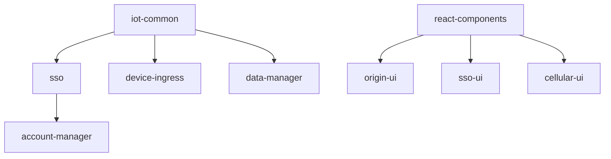

# NetNeural Software Monorepo

A comprehensive collection of NetNeural's software components for IoT device management, monitoring, and control systems.

## 🏗️ Architecture Overview

The NetNeural platform is built on a microservices architecture supporting IoT device management, real-time monitoring, and alert systems. The monorepo contains 50+ repositories organized into distinct functional areas.

### Technology Stack

- **Backend**: Go (30 services)
- **Frontend**: React + TypeScript (5 applications)
- **Mobile**: iOS (Swift), Android (Java)
- **Infrastructure**: Python utilities, Docker, Kubernetes
- **Communication**: MQTT, WebSocket, REST APIs
- **Databases**: PostgreSQL, MySQL
- **Message Queuing**: MQTT brokers

## 📁 Repository Structure

```
SoftwareMono/
├── 🌐 Frontend Applications (5)
│   ├── origin-ui/              # Main dashboard UI
│   ├── sso-ui/                 # Single Sign-On interface
│   ├── cellular-ui/            # Cellular device management
│   ├── store-ui/               # E-commerce frontend
│   └── react-components/       # Shared React component library
├── 📱 Mobile Applications (2)
│   ├── nn-alerts-ios/          # iOS alerts application
│   └── Alerts-Android/         # Android alerts application
├── 🔧 Backend Services (30)
│   ├── Core Services
│   │   ├── sso/               # Single Sign-On service
│   │   ├── account-manager/   # User account management
│   │   ├── notifications/     # Notification service
│   │   └── iot-common/        # Common Go types and utilities
│   ├── Device Management
│   │   ├── device-ingress/    # Device data ingestion
│   │   ├── digital-twin/      # Digital twin implementation
│   │   ├── cellular-manager/  # Cellular device management
│   │   ├── cellular-gateway/  # Cellular communication gateway
│   │   └── edge-vmark-input/  # Edge device input handling
│   ├── Data Processing
│   │   ├── data-manager/      # Core data management
│   │   ├── cloud-data-manager/ # Cloud data operations
│   │   ├── api-slurper/       # API data aggregation
│   │   ├── mqtt2db/           # MQTT to database bridge
│   │   └── recall-ingest/     # Recall data processing
│   ├── Alert Systems
│   │   ├── alert-listener/    # Alert processing service  
│   │   ├── alerts-bfu/        # Business function unit alerts
│   │   └── cellular-alerts/   # Cellular-specific alerts
│   └── Gateway Services
│       ├── vmark-cloud-gateway/ # Cloud gateway service
│       ├── ui-dev-server/     # UI development server
│       └── core-ui/           # Core UI backend
├── 📦 Bundle Components (11)
│   ├── bundle-api-provision-thread/    # API provisioning
│   ├── bundle-input-device-rest/       # REST device input
│   ├── bundle-iot-device-admin/        # IoT device administration
│   ├── bundle-mdns-core-python/        # mDNS core (Python)
│   ├── bundle-other-mdns-hub/          # mDNS hub functionality
│   ├── bundle-output-netneural/        # NetNeural output handling
│   ├── bundle-provision-security-data-netneural/ # Security provisioning
│   └── bundle-template-*/              # Template bundles (C++, Java, Python)
├── 🛠️ Infrastructure & Tools (7)
│   ├── docker-build-template/  # Docker build templates
│   ├── action-get-latest-tag/  # GitHub Actions utility
│   ├── digital-ocean-k8s-setup/ # Kubernetes setup scripts
│   ├── dev-coap-server-californium/ # CoAP server development
│   ├── test-stripe-backend/    # Payment testing backend
│   ├── merchandising/          # E-commerce merchandising
│   └── hydrant/                # System utilities
└── 🔗 Integration Services (5)
    ├── cloud-device-admin-mqtt/ # Cloud MQTT device admin
    ├── core-mdns-site-local-broadcast/ # Local network discovery
    ├── mod-edge-core/          # Edge computing core
    ├── ot-commissioner/        # OpenThread commissioner
    └── Onboarding/             # Device onboarding flows
```

## 🚀 Quick Start

### Prerequisites

- **Go**: 1.24+
- **Node.js**: 18+  
- **Docker**: Latest
- **Git**: Latest
- **GitHub CLI**: For repository management

### Initial Setup

1. **Clone the monorepo** (already done):
   ```bash
   # Repositories cloned via clone_all_repos.sh
   ls -la  # View all 50+ repositories
   ```

2. **Set up Go environment**:
   ```bash
   export GOPRIVATE=github.com/NetNeural/*
   git config --global url."ssh://git@github.com/".insteadOf "https://github.com/"
   ```

3. **Install frontend dependencies**:
   ```bash
   # For each React project
   cd origin-ui && npm install
   cd ../sso-ui && npm install  
   cd ../cellular-ui && npm install
   cd ../react-components && npm install
   ```

### Development Workflow

#### Backend Services (Go)
```bash
# Example: Running SSO service
cd sso
go mod tidy
go run main.go
```

#### Frontend Applications (React)
```bash
# Example: Running Origin UI
cd origin-ui
npm run dev          # Development server
npm run build        # Production build
npm run storybook    # Component documentation
```

#### Mobile Applications
```bash
# iOS
cd nn-alerts-ios
# Open in Xcode

# Android  
cd Alerts-Android
# Open in Android Studio
```

## 🔧 Service Details

### Core Backend Services

#### Authentication & Authorization
- **`sso/`**: Single Sign-On microservice with JWT support
  - Technologies: Go, Gin, JWT, PostgreSQL
  - Features: User authentication, token management
  - Dependencies: `iot-common`

- **`account-manager/`**: User account management
  - Technologies: Go, OpenAPI code generation
  - Features: User profiles, account operations

#### Data Management
- **`data-manager/`**: Core data processing service
- **`cloud-data-manager/`**: Cloud-based data operations  
- **`device-ingress/`**: Device data ingestion pipeline
- **`api-slurper/`**: API data aggregation service
- **`mqtt2db/`**: MQTT message to database bridge

#### Device & IoT Management
- **`digital-twin/`**: Digital twin implementation
- **`cellular-manager/`**: Cellular device management
- **`cellular-gateway/`**: Cellular communication gateway
- **`edge-vmark-input/`**: Edge device input processing
- **`iot-common/`**: Shared Go types and utilities for IoT services

#### Alert & Notification Systems
- **`alert-listener/`**: Central alert processing
- **`alerts-bfu/`**: Business function unit alerts
- **`cellular-alerts/`**: Cellular-specific alerting
- **`notifications/`**: Multi-channel notification service

### Frontend Applications

#### Main Applications
- **`origin-ui/`**: Primary dashboard interface
  - Technologies: React 19, TypeScript, Vite, Ant Design
  - Features: Real-time monitoring, device management, 3D visualization
  - Dependencies: `@netneural/react-components`

- **`sso-ui/`**: Authentication interface
- **`cellular-ui/`**: Cellular device management interface  
- **`store-ui/`**: E-commerce frontend

#### Shared Components
- **`react-components/`**: Shared React component library
  - Published as `@netneural/react-components`
  - Includes Storybook documentation
  - Supports both React 18 and 19

### Mobile Applications
- **`nn-alerts-ios/`**: iOS native alerts application
- **`Alerts-Android/`**: Android native alerts application with Firebase integration

### Bundle Components
The bundle components provide modular functionality for IoT device integration:
- **API Provisioning**: `bundle-api-provision-thread/`
- **Device Input**: `bundle-input-device-rest/`
- **Device Administration**: `bundle-iot-device-admin/`
- **Network Discovery**: `bundle-mdns-core-python/`, `bundle-other-mdns-hub/`
- **Security**: `bundle-provision-security-data-netneural/`
- **Templates**: Language-specific templates for C++, Java, Python

## 🔄 Dependencies & Integration

### Service Dependencies


### Data Flow
1. **Device Data**: `device-ingress` → `data-manager` → `digital-twin`
2. **Alerts**: `alert-listener` → `notifications` → Mobile Apps
3. **Authentication**: `sso` → Frontend Apps → Backend Services
4. **Cellular**: `cellular-gateway` → `cellular-manager` → `cellular-ui`

## 🚢 Deployment

### Docker Deployment
Most services include Dockerfiles. Use the `docker-build-template/` for standardized builds.

```bash
# Example deployment
cd sso
docker build -t netneural/sso .
docker run -p 8080:8080 netneural/sso
```

### Kubernetes Deployment  
Use `digital-ocean-k8s-setup/` for Kubernetes cluster configuration.

## 🧪 Testing

### Backend Testing
```bash
# Go services
cd sso
go test ./...
```

### Frontend Testing
```bash
# React applications
cd origin-ui
npm test                    # Unit tests
npm run test:e2e           # E2E tests (if available)
```

## 📚 Documentation

### API Documentation
- Services use OpenAPI/Swagger specifications
- Frontend components documented via Storybook

### Component Documentation
```bash
cd react-components
npm run storybook          # View component library
```

### Service Documentation  
Each service includes:
- README.md with setup instructions
- API documentation
- Docker configuration
- Environment variable specifications

## 🔐 Security

### Authentication Flow
1. Users authenticate via `sso/` service
2. JWT tokens issued for API access
3. Services validate tokens using `iot-common` utilities

### API Security
- HTTPS/TLS for all communications
- JWT-based authentication  
- Role-based access control
- Rate limiting and validation

## 🏃‍♂️ Development Guidelines

### Code Standards
- **Go**: Follow standard Go conventions, use `gofmt`
- **TypeScript**: ESLint configuration included
- **Testing**: Comprehensive test coverage required
- **Documentation**: Update README.md for any changes

### Git Workflow
- Feature branches for new development
- Pull requests required for main branch
- Automated testing via GitHub Actions

### Environment Variables
Each service requires specific environment configuration. Check individual README files for details.

## 🤝 Contributing

1. Fork the specific repository
2. Create a feature branch
3. Make changes with tests
4. Submit pull request
5. Code review and merge

## 📞 Support

For technical support and questions:
- Check individual service README files
- Review API documentation
- Contact the development team

## 📄 License

Individual repositories may have specific licenses. Check each repository's LICENSE file for details.

---

*This documentation covers the complete NetNeural software ecosystem. For service-specific details, refer to individual repository documentation.*
