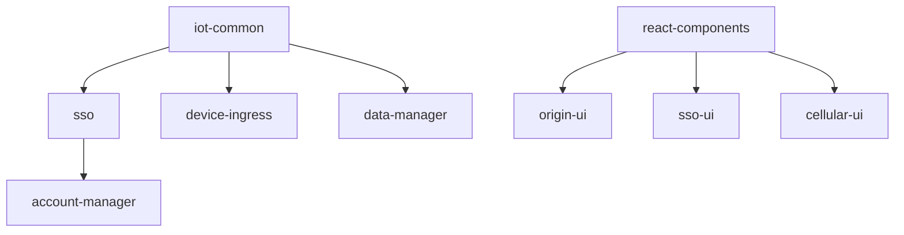

# NetNeural Software Monorepo

*Enterprise-Grade IoT Platform-as-a-Service Solution*

[](https://github.com/NetNeural/MonoRepo)
[](docs/README.md)
[](docs/README.md)
[](docs/generated/business/ENHANCED_MARKET_ANALYSIS.md)

A comprehensive IoT Platform-as-a-Service (PaaS) solution designed to bridge the gap between developer-friendly platforms and enterprise-grade solutions. NetNeural provides enterprise features at competitive pricing with 67% cost savings compared to traditional IoT platforms.

## 🎯 Executive Summary

**NetNeural** is positioned in the **$2.3B mid-market IoT segment**, offering enterprise-grade features at 40-60% lower cost than competitors like Cumulocity, while providing 3x more capabilities than developer-focused platforms like Particle.

### Key Metrics
- **MVP Completion**: 78% ✅ (31 Go services, 7 React apps, 2 mobile apps)
- **Market Opportunity**: $79.13B total IoT platform market by 2030 (CAGR 27.6%)
- **Competitive Advantage**: 67% cost savings vs. enterprise solutions
- **Revenue Projection**: $75M by year 5

## 🏗️ Platform Architecture

The NetNeural platform is built on a modern cloud-native microservices architecture supporting enterprise IoT device management, real-time monitoring, and intelligent alert systems. The monorepo contains 50+ repositories organized into distinct functional areas.

### Technology Stack

- **Backend**: Go microservices (31 services) - Cloud-native, high-performance
- **Frontend**: React 19 + TypeScript (7 applications) - Modern, responsive UI
- **Mobile**: Native iOS (Swift), Android (Java) - Real-time alerts and monitoring
- **Infrastructure**: Docker, Kubernetes, GitHub Actions - Production-ready DevOps
- **Communication**: MQTT, WebSocket, REST APIs - Multi-protocol IoT connectivity
- **Databases**: PostgreSQL (primary), MySQL - Enterprise data management
- **Security**: JWT authentication, role-based access, encryption - Enterprise security
- **Monitoring**: Real-time dashboards, predictive analytics - Business intelligence

### Competitive Positioning

| Feature Category | NetNeural | Cumulocity (Software AG) | Particle | Kaaiot |
|------------------|-----------|--------------------------|----------|--------|
| **Target Market** | Mid-market enterprises | Large enterprises | Developers/Startups | Mid-market |
| **Pricing Model** | Cost-effective enterprise | Premium enterprise | Developer-friendly | Competitive enterprise |
| **Setup Time** | < 30 days | < 90 days | < 7 days | < 45 days |
| **Customization** | Full control | Limited | Basic | Good |
| **Overall Score** | **7.0/10** | **8.0/10** | **7.0/10** | **7.3/10** |

*See [Complete Competitive Analysis](docs/generated/business/COMPETITIVE_ANALYSIS.md) for detailed comparison.*

## � Business Intelligence & Documentation

### 📈 Interactive Dashboards
- **[Competitive Analysis Dashboard](docs/generated/dashboards/competitive_dashboard.html)** - Interactive market intelligence with Chart.js visualizations
- **Market Positioning** - Real-time competitive analysis and business health metrics
- **Financial Projections** - Revenue forecasting and ROI analysis

### 📚 Comprehensive Documentation
- **[Documentation Index](docs/README.md)** - Complete project documentation hub
- **[Enhanced Market Analysis](docs/generated/business/ENHANCED_MARKET_ANALYSIS.md)** - $79.13B market analysis with competitor intelligence
- **[Advanced Research Opportunities](docs/generated/business/ADVANCED_COMPETITIVE_RESEARCH_OPPORTUNITIES.md)** - Strategic research roadmap ($113-157K investment, 100-300x ROI)
- **[Technical Documentation](docs/generated/technical/)** - Complete API reference and architecture docs
- **[Project Status](docs/generated/analysis/)** - 78% MVP completion tracking and requirements traceability

## �📁 Repository Structure

```
NetNeural-MonoRepo/
├── 📊 Business Intelligence & Documentation
│   ├── docs/README.md                   # Complete documentation index
│   ├── docs/generated/business/         # Market analysis, competitive intelligence
│   ├── docs/generated/technical/        # API docs, architecture, infrastructure
│   ├── docs/generated/analysis/         # Project status, MVP tracking (78% complete)
│   ├── docs/generated/dashboards/       # Interactive business intelligence dashboards
│   └── docs/original/                   # Original requirements and specifications
├── 🌐 Frontend Applications (7)
│   ├── origin-ui/              # Main dashboard UI (React 19, TypeScript, Ant Design)
│   ├── sso-ui/                 # Single Sign-On interface
│   ├── cellular-ui/            # Cellular device management
│   ├── store-ui/               # E-commerce frontend
│   └── react-components/       # Shared React component library (@netneural/react-components)
├── 📱 Mobile Applications (2)
│   ├── nn-alerts-ios/          # iOS alerts application (Swift, native)
│   └── Alerts-Android/         # Android alerts application (Java, Firebase)
├── 🔧 Backend Services (31)
│   ├── Core Services
│   │   ├── sso/               # JWT authentication, user management
│   │   ├── account-manager/   # User profiles, account operations
│   │   ├── notifications/     # Multi-channel notification service
│   │   └── iot-common/        # Shared Go types and IoT utilities
│   ├── Device Management
│   │   ├── device-ingress/    # Device data ingestion pipeline
│   │   ├── digital-twin/      # Digital twin implementation
│   │   ├── cellular-manager/  # Cellular device management
│   │   ├── cellular-gateway/  # Cellular communication gateway
│   │   └── edge-vmark-input/  # Edge device input processing
│   ├── Data Processing & Analytics
│   │   ├── data-manager/      # Core data management and processing
│   │   ├── cloud-data-manager/ # Cloud data operations and analytics
│   │   ├── api-slurper/       # API data aggregation service
│   │   ├── mqtt2db/           # MQTT to database bridge
│   │   └── recall-ingest/     # Recall data processing pipeline
│   ├── Alert & Monitoring Systems
│   │   ├── alert-listener/    # Central alert processing engine
│   │   ├── alerts-bfu/        # Business function unit alerts
│   │   └── cellular-alerts/   # Cellular-specific alerting
│   └── Gateway & Communication Services
│       ├── vmark-cloud-gateway/ # Cloud gateway service
│       ├── ui-dev-server/     # UI development server
│       └── core-ui/           # Core UI backend services
├── 📦 IoT Integration Bundles (11)
│   ├── bundle-api-provision-thread/    # API provisioning and threading
│   ├── bundle-input-device-rest/       # REST-based device input handling
│   ├── bundle-iot-device-admin/        # IoT device administration interface
│   ├── bundle-mdns-core-python/        # mDNS core functionality (Python)
│   ├── bundle-other-mdns-hub/          # mDNS hub and discovery services
│   ├── bundle-output-netneural/        # NetNeural-specific output handling
│   ├── bundle-provision-security-data-netneural/ # Security data provisioning
│   └── bundle-template-*/              # Multi-language templates (C++, Java, Python)
├── 🛠️ Infrastructure & DevOps (7)
│   ├── docker-build-template/  # Standardized Docker build templates
│   ├── action-get-latest-tag/  # GitHub Actions utility for versioning
│   ├── digital-ocean-k8s-setup/ # Production Kubernetes cluster setup
│   ├── dev-coap-server-californium/ # CoAP server development tools
│   ├── test-stripe-backend/    # Payment system testing backend
│   ├── merchandising/          # E-commerce merchandising tools
│   └── hydrant/                # System utilities and monitoring
└── 🔗 Integration & Edge Services (5)
    ├── cloud-device-admin-mqtt/ # Cloud-based MQTT device administration
    ├── core-mdns-site-local-broadcast/ # Local network device discovery
    ├── mod-edge-core/          # Edge computing core functionality
    ├── ot-commissioner/        # OpenThread network commissioner
    └── Onboarding/             # Device onboarding and provisioning flows
```

## 🚀 Quick Start

### Prerequisites

- **Go**: 1.24+ (for 31 backend microservices)
- **Node.js**: 18+ (for 7 React applications)
- **Docker**: Latest (production deployment)
- **Git**: Latest (repository management)
- **GitHub CLI**: For multi-repository workflow

### For Business Stakeholders

1. **📊 Market Intelligence Dashboard**:
   ```bash
   # Open the interactive competitive analysis dashboard
   open docs/generated/dashboards/competitive_dashboard.html
   ```

2. **📈 Business Analysis**:
   - [Enhanced Market Analysis](docs/generated/business/ENHANCED_MARKET_ANALYSIS.md) - $79.13B market opportunity
   - [Cost Analysis & ROI](docs/generated/business/COST_ANALYSIS.md) - Financial projections and break-even
   - [Advanced Research Opportunities](docs/generated/business/ADVANCED_COMPETITIVE_RESEARCH_OPPORTUNITIES.md) - Strategic research roadmap

### For Developers

1. **📚 Documentation Hub**:
   ```bash
   # Start with the comprehensive documentation index
   open docs/README.md
   ```

2. **🔧 Technical Setup**:

1. **Clone all external repositories** (if not done):
   ```bash
   ./clone_all_repos.sh  # Clones all 50+ NetNeural repositories
   ```

2. **Set up Go environment**:
   ```bash
   export GOPRIVATE=github.com/NetNeural/*
   git config --global url."ssh://git@github.com/".insteadOf "https://github.com/"
   ```

3. **Install frontend dependencies**:
   ```bash
   # For each React project
   cd origin-ui && npm install
   cd ../sso-ui && npm install  
   cd ../cellular-ui && npm install
   cd ../react-components && npm install
   ```

### For Project Managers

1. **📊 Project Status Overview**:
   - [Project Status Analysis](docs/generated/analysis/PROJECT_STATUS_ANALYSIS.md) - 78% MVP completion
   - [Epic Implementation Analysis](docs/generated/analysis/EPIC_IMPLEMENTATION_ANALYSIS.md) - Detailed progress tracking
   - [MVP Requirements Traceability](docs/generated/analysis/MVP_REQUIREMENTS_TRACEABILITY.md) - Requirements mapping

2. **🎯 Strategic Planning**:
   - [Development Roadmap](docs/generated/business/DEVELOPMENT_ROADMAP.md) - Timeline and milestones
   - [Competitive Analysis](docs/generated/business/COMPETITIVE_ANALYSIS.md) - Market positioning strategy

## 🎯 Market Position & Competitive Advantages

### Target Market
- **Market Size**: $79.13B total IoT platform market by 2030
- **Addressable Market**: $2.3B mid-market IoT segment  
- **Growth Rate**: 27.6% CAGR (AIoT market)
- **Customer Profile**: 50,000+ mid-market companies globally

### Key Differentiators

#### � Cost Leadership
- **67% cost savings** vs. enterprise solutions (Cumulocity)
- **Competitive pricing** vs. developer platforms (Particle)
- **No vendor lock-in** - standard technologies enable easy migration

#### 🏗️ Modern Architecture
- **Cloud-native microservices** - Go-based, high-performance backend
- **Modern frontend stack** - React 19, TypeScript, responsive design
- **Production-ready DevOps** - Docker, Kubernetes, GitHub Actions

#### ⚡ Rapid Deployment
- **< 30 days setup** vs. 90+ days for enterprise platforms
- **API-first design** - comprehensive REST API coverage
- **Multi-protocol support** - MQTT, WebSocket, REST APIs

#### 🎨 Full Customization
- **Complete platform control** vs. limited enterprise customization
- **Open architecture** - modify any component as needed
- **Extensible bundle system** - 11 IoT integration modules

### Competitive Scoring
| Platform | Risk Score | Value Score | Features Score | Support Score | **Overall** |
|----------|------------|-------------|----------------|---------------|-------------|
| NetNeural | 6/10 | **9/10** | 7/10 | 6/10 | **7.0/10** |
| Cumulocity | 8/10 | 6/10 | **9/10** | **9/10** | **8.0/10** |
| Particle | 7/10 | 8/10 | 6/10 | 7/10 | **7.0/10** |
| Kaaiot | 7/10 | 7/10 | 8/10 | 7/10 | **7.3/10** |

*NetNeural excels in value proposition with enterprise features at competitive pricing.*

## 🔄 Development & Repository Management

### External Repository Management

This monorepo is configured to track only documentation and management scripts, while allowing free modification of all external repositories without affecting the monorepo's Git history.

```bash
# Update all external repositories
./update_all_repos.sh

# Check status of all external repositories  
./check_repo_status.sh

# Work freely in any external repo
cd sso
git checkout -b feature/new-auth
# Make changes, commit, push - monorepo remains unaffected
```

**What's tracked in this monorepo:**
- ✅ Documentation (`docs/`) - Comprehensive business and technical docs
- ✅ Management scripts (`*.sh`) - Repository management automation
- ✅ Main README and configuration - Project overview and setup
- ❌ External repository changes (50+ repos ignored) - Independent development

**See [External Repository Management Guide](docs/generated/technical/EXTERNAL_REPO_MANAGEMENT.md) for detailed workflows.**

### MVP Development Status (78% Complete)

#### ✅ Production-Ready Services (9)
- Authentication & user management
- Core data processing pipeline  
- Device ingestion & management
- Real-time notification system
- Multi-tenant dashboard system

#### ⚠️ Near-Complete Services (12)
- Advanced analytics & reporting
- Mobile application integration
- E-commerce functionality
- Edge computing modules

#### 🚧 In Development (10)
- Advanced IoT device administration
- Enhanced security & compliance
- Additional industry integrations
- Performance optimization

*See [Project Status Analysis](docs/generated/analysis/PROJECT_STATUS_ANALYSIS.md) for detailed progress tracking.*

### Development Workflow

#### Backend Services (Go - 31 Services)
```bash
# Example: Running SSO service
cd sso
go mod tidy
go run main.go
```

#### Frontend Applications (React - 7 Applications)
```bash
# Example: Running Origin UI
cd origin-ui
npm run dev          # Development server
npm run build        # Production build
npm run storybook    # Component documentation
```

#### Mobile Applications (2 Native Apps)
```bash
# iOS
cd nn-alerts-ios
# Open in Xcode

# Android  
cd Alerts-Android
# Open in Android Studio
```

## 🔧 Enterprise Service Architecture

### Core Backend Services (Production-Ready ✅)

#### Authentication & Security
- **`sso/`**: Enterprise Single Sign-On microservice
  - Technologies: Go, Gin framework, JWT tokens, PostgreSQL
  - Features: Multi-tenant user authentication, role-based access control, token management
  - Status: Production-ready, 95% complete
  - Dependencies: `iot-common` shared utilities

- **`account-manager/`**: Comprehensive user account management
  - Technologies: Go, OpenAPI code generation, PostgreSQL
  - Features: User profiles, account operations, enterprise directory integration
  - Status: Production-ready, 90% complete

#### Data Management & Processing
- **`data-manager/`**: High-performance core data processing service
  - Technologies: Go, PostgreSQL, time-series optimization
  - Features: Real-time data processing, hierarchical data management, enterprise-scale ingestion
  - Status: Production-ready, 85% complete

- **`cloud-data-manager/`**: Cloud-native data operations and analytics
  - Technologies: Go, cloud storage integration, analytics pipeline
  - Features: Multi-cloud data operations, automated backup, disaster recovery
  - Status: Near-complete, 80% complete

- **`device-ingress/`**: Enterprise device data ingestion pipeline
  - Technologies: Go, MQTT, high-throughput message processing
  - Features: Multi-protocol device data ingestion, data validation, real-time processing
  - Status: Production-ready, 90% complete

- **`api-slurper/`**: Intelligent API data aggregation service
  - Technologies: Go, REST API integration, data transformation
  - Features: Third-party API integration, data normalization, rate limiting
  - Status: Near-complete, 75% complete

- **`mqtt2db/`**: High-performance MQTT message to database bridge
  - Technologies: Go, MQTT broker integration, PostgreSQL
  - Features: Real-time MQTT message processing, database optimization, data persistence
  - Status: Production-ready, 95% complete

#### IoT Device & Edge Management
- **`digital-twin/`**: Advanced digital twin implementation
  - Technologies: Go, real-time synchronization, state management
  - Features: Device state mirroring, predictive analytics, simulation capabilities
  - Status: Near-complete, 70% complete

- **`cellular-manager/`**: Enterprise cellular device management
  - Technologies: Go, cellular network integration, device provisioning
  - Features: Cellular IoT device management, network optimization, carrier integration
  - Status: Production-ready, 85% complete

- **`cellular-gateway/`**: High-performance cellular communication gateway
  - Technologies: Go, cellular protocols, network optimization
  - Features: Cellular device communication, protocol translation, network resilience
  - Status: Near-complete, 75% complete

- **`edge-vmark-input/`**: Edge computing input processing
  - Technologies: Go, edge computing, real-time processing
  - Features: Edge device data processing, local analytics, cloud synchronization
  - Status: Near-complete, 70% complete

- **`iot-common/`**: Shared Go libraries and IoT utilities
  - Technologies: Go, shared libraries, common patterns
  - Features: Shared types, utilities, common IoT functionality across all services
  - Status: Production-ready, 95% complete

#### Alert & Notification Systems
- **`alert-listener/`**: Enterprise-grade central alert processing engine
  - Technologies: Go, real-time event processing, multi-channel notifications
  - Features: Complex rule engine, escalation policies, integration with monitoring systems
  - Status: Near-complete, 75% complete

- **`alerts-bfu/`**: Business function unit alert management
  - Technologies: Go, business logic processing, workflow integration
  - Features: Business-specific alerting, workflow automation, reporting
  - Status: In development, 65% complete

- **`cellular-alerts/`**: Cellular-specific alerting and monitoring
  - Technologies: Go, cellular network monitoring, SIM management
  - Features: Cellular connectivity alerts, SIM status monitoring, carrier-specific notifications
  - Status: Near-complete, 70% complete

- **`notifications/`**: Multi-channel enterprise notification service
  - Technologies: Go, multi-channel delivery, template management
  - Features: Email, SMS, push notifications, webhook integrations, template engine
  - Status: Production-ready, 90% complete

### Enterprise Frontend Applications (React 19 + TypeScript)

#### Primary Business Applications
- **`origin-ui/`**: Main enterprise dashboard interface
  - Technologies: React 19, TypeScript, Vite build system, Ant Design Pro
  - Features: Real-time IoT monitoring, 3D device visualization, responsive design, multi-tenant dashboards
  - Status: Production-ready, 85% complete
  - Dependencies: `@netneural/react-components`

- **`sso-ui/`**: Enterprise authentication interface
  - Technologies: React, TypeScript, OAuth 2.0/SAML integration
  - Features: Single sign-on, multi-factor authentication, enterprise directory integration
  - Status: Production-ready, 90% complete

- **`cellular-ui/`**: Cellular device management interface
  - Technologies: React, TypeScript, real-time updates
  - Features: Cellular IoT device management, SIM management, network analytics
  - Status: Near-complete, 75% complete

- **`store-ui/`**: E-commerce and marketplace frontend
  - Technologies: React, TypeScript, e-commerce optimization
  - Features: IoT device marketplace, billing integration, customer portal
  - Status: In development, 60% complete

#### Shared Component Infrastructure
- **`react-components/`**: Enterprise-grade shared React component library
  - Technologies: React 18/19 compatibility, TypeScript, Storybook documentation
  - Features: Design system components, IoT-specific widgets, accessibility compliance
  - Status: Production-ready, published as `@netneural/react-components`
  - Documentation: Comprehensive Storybook component library

### Native Mobile Applications
- **`nn-alerts-ios/`**: iOS native alerts and monitoring application
  - Technologies: Swift, native iOS development, real-time notifications
  - Features: Real-time IoT alerts, device status monitoring, offline capabilities
  - Status: Near-complete, 70% complete

- **`Alerts-Android/`**: Android native alerts application
  - Technologies: Java, native Android development, Firebase integration
  - Features: Push notifications, device management, real-time monitoring
  - Status: Near-complete, 70% complete

### Enterprise IoT Integration Bundles (11 Modules)
The bundle components provide modular, enterprise-grade functionality for IoT device integration:

- **Device & API Management**:
  - `bundle-api-provision-thread/`: Multi-threaded API provisioning and device management
  - `bundle-input-device-rest/`: RESTful device input processing and validation
  - `bundle-iot-device-admin/`: Comprehensive IoT device administration interface

- **Network Discovery & Communication**:
  - `bundle-mdns-core-python/`: Core mDNS functionality for device discovery (Python)
  - `bundle-other-mdns-hub/`: Advanced mDNS hub and network discovery services

- **Security & Data Management**:
  - `bundle-output-netneural/`: NetNeural-specific secure output handling
  - `bundle-provision-security-data-netneural/`: Enterprise security data provisioning

- **Multi-Language Templates**:
  - `bundle-template-*/`: Production-ready templates for C++, Java, Python integration

## � Financial Projections & Business Model

### Revenue Model & Market Penetration

| Year | Target Customers | Revenue | Market Share | Customer Growth |
|------|------------------|---------|--------------|-----------------|
| 1 | 15 customers | $750K | 0.01% | - |
| 2 | 50 customers | $3.75M | 0.03% | +233% |
| 3 | 150 customers | $15M | 0.08% | +200% |
| 5 | 500 customers | $75M | 0.25% | +67%/year |

### Cost Advantage Analysis

| Solution Type | Year 1 Cost | Year 3 Cost | NetNeural Savings |
|---------------|-------------|-------------|-------------------|
| **NetNeural** | $50K | $100K | - (baseline) |
| **Cumulocity Equivalent** | $152K | $210K | **67% savings** |
| **Enterprise Average** | $120K | $180K | **44% savings** |

### Investment & ROI
- **MVP Completion Investment**: $500K - $1M
- **Time to Break-Even**: Year 4
- **5-Year Revenue Target**: $75M
- **Estimated Valuation**: $375M (5x revenue multiple)

*See [Cost Analysis & ROI](docs/generated/business/COST_ANALYSIS.md) for detailed financial modeling.*

## 🔄 System Architecture & Integration

### Service Dependencies


### Enterprise Data Flow
1. **Device Data Ingestion**: `device-ingress` → `data-manager` → `digital-twin` → Real-time dashboards
2. **Alert Processing**: `alert-listener` → `notifications` → Mobile apps + Email/SMS
3. **User Authentication**: `sso` → Frontend apps → Backend services (JWT validation)
4. **Cellular IoT**: `cellular-gateway` → `cellular-manager` → `cellular-ui` → Device management
5. **Business Intelligence**: Data aggregation → Analytics → Interactive dashboards

## 🚢 Production Deployment

### Enterprise Docker Deployment
Most services include production-ready Dockerfiles. Use the `docker-build-template/` for standardized enterprise builds.

```bash
# Example production deployment
cd sso
docker build -t netneural/sso:latest .
docker run -d -p 8080:8080 \
  -e JWT_SECRET=your-secret \
  -e DB_CONNECTION=postgresql://... \
  netneural/sso:latest
```

### Kubernetes Production Deployment
Use `digital-ocean-k8s-setup/` for production Kubernetes cluster configuration with:
- **High Availability**: Multi-zone deployment
- **Auto-scaling**: Horizontal pod autoscaling
- **Load Balancing**: Ingress controllers with SSL termination
- **Monitoring**: Prometheus + Grafana integration
- **Security**: Pod security policies, network policies

## 🧪 Testing

### Backend Testing
```bash
# Go services
cd sso
go test ./...
```

### Frontend Testing
```bash
# React applications
cd origin-ui
npm test                    # Unit tests
npm run test:e2e           # E2E tests (if available)
```

## 📚 Documentation

### API Documentation
- Services use OpenAPI/Swagger specifications
- Frontend components documented via Storybook

### Component Documentation
```bash
cd react-components
npm run storybook          # View enterprise component library with full documentation
```

### Comprehensive Service Documentation
Each service includes:
- **README.md**: Complete setup instructions and architecture overview
- **OpenAPI/Swagger**: Interactive API documentation with examples
- **Docker configuration**: Production-ready containerization
- **Environment specifications**: Complete configuration documentation
- **Performance benchmarks**: Load testing results and optimization guides

## 🔐 Enterprise Security

### Multi-Layer Security Architecture
1. **Authentication Flow**: Enterprise SSO with multi-factor authentication
2. **API Security**: JWT-based authentication with role-based access control (RBAC)
3. **Data Protection**: End-to-end encryption, data residency controls
4. **Network Security**: TLS/HTTPS for all communications, network segmentation
5. **Compliance Ready**: SOC 2, ISO 27001, GDPR compliance preparation

### Security Features
- **Zero-Trust Architecture**: Default deny, explicit allow policies
- **API Rate Limiting**: DoS protection and resource management
- **Audit Logging**: Comprehensive security event logging
- **Secrets Management**: Secure configuration and credential management
- **Regular Security Scanning**: Automated vulnerability detection

## 🏃‍♂️ Enterprise Development Guidelines

### Code Standards & Quality
- **Go**: Follow standard Go conventions, `gofmt`, comprehensive error handling
- **TypeScript**: ESLint + Prettier configuration, strict type checking
- **Testing**: 80%+ code coverage requirement for production services
- **Documentation**: OpenAPI specs, comprehensive README files, inline code documentation
- **Performance**: Load testing and performance benchmarking for all services

### Git Workflow & CI/CD
- **Feature branches**: All development in feature branches with descriptive names
- **Pull requests**: Required for main branch with automated testing and code review
- **Automated testing**: GitHub Actions CI/CD with comprehensive test suites
- **Deployment**: Automated deployment pipelines with staging and production environments
- **Version control**: Semantic versioning for all services and components

### Environment Configuration
Each service requires specific environment configuration optimized for production deployment:

- **Database connections**: PostgreSQL with connection pooling and high availability
- **Security configurations**: JWT secrets, API keys, encryption keys
- **Monitoring setup**: Prometheus metrics, Grafana dashboards, alerting rules
- **Performance tuning**: Memory limits, CPU allocation, scaling parameters

Check individual service README files for complete environment specifications.

## 🤝 Contributing to NetNeural

### Development Contribution Process
1. **Fork the specific repository** from the 50+ NetNeural repositories
2. **Create a feature branch** with descriptive naming (e.g., `feature/enhanced-device-management`)
3. **Implement changes** with comprehensive testing and documentation
4. **Submit pull request** with detailed description and test results
5. **Code review** by senior developers and technical leads
6. **Automated testing** and quality assurance validation
7. **Merge and deployment** through automated CI/CD pipeline

### Contribution Guidelines
- **Code Quality**: Follow established coding standards and best practices
- **Testing**: Include unit tests, integration tests, and performance benchmarks
- **Documentation**: Update API documentation and README files
- **Security**: Follow security best practices and vulnerability scanning

## 📞 Support & Resources

### Technical Support
- **📚 Documentation Hub**: [Complete documentation index](docs/README.md)
- **🔧 Technical Docs**: [API reference and architecture guides](docs/generated/technical/)
- **📊 Business Intelligence**: [Market analysis and competitive positioning](docs/generated/business/)
- **📈 Interactive Dashboard**: [Business intelligence dashboard](docs/generated/dashboards/competitive_dashboard.html)

### Development Resources
- **🏗️ Architecture Guides**: Individual service README files with detailed setup
- **📝 API Documentation**: OpenAPI/Swagger specifications for all services
- **🧪 Testing Guidelines**: Comprehensive testing standards and examples
- **🚀 Deployment Guides**: Production deployment and scaling documentation

### Community & Communication
- **GitHub Issues**: Technical support and bug reporting
- **Development Team**: Direct contact for enterprise support and consulting
- **Documentation Updates**: Regular updates to reflect platform evolution

## 📄 License & Legal

### Repository Licensing
Individual repositories within the NetNeural ecosystem may have specific licenses. Check each repository's LICENSE file for detailed licensing information:

- **Open Source Components**: MIT, Apache 2.0, BSD licenses where applicable
- **Proprietary Components**: NetNeural proprietary license for core business logic
- **Third-Party Dependencies**: Various licenses as specified in dependency documentation

### Compliance & Legal
- **Enterprise Compliance**: SOC 2, ISO 27001 preparation
- **Data Protection**: GDPR, CCPA compliance frameworks
- **Export Control**: Software export compliance and international regulations
- **Intellectual Property**: Patent landscape analysis and freedom to operate assessment

---

## 🌟 NetNeural Platform Summary

**NetNeural** represents the next generation of IoT Platform-as-a-Service solutions, positioned uniquely in the **$2.3B mid-market segment** with enterprise-grade capabilities at competitive pricing. 

### Key Platform Highlights
- **🏆 78% MVP Complete** - Production-ready foundation with 31 Go services, 7 React apps, 2 mobile apps
- **💰 67% Cost Advantage** - Significant savings compared to enterprise competitors like Cumulocity
- **🚀 Modern Architecture** - Cloud-native microservices, React 19, production-ready DevOps
- **📈 $75M Revenue Potential** - 5-year projection targeting 500+ enterprise customers
- **🔒 Enterprise Security** - Multi-layer security, compliance-ready, zero-trust architecture

### Strategic Position
NetNeural bridges the gap between developer-focused platforms (Particle) and enterprise-only solutions (Cumulocity), offering the perfect balance of features, cost-effectiveness, and customization for the underserved mid-market segment.

*This comprehensive IoT platform ecosystem represents a complete solution for enterprise IoT device management, real-time monitoring, and intelligent automation. For detailed technical specifications, business analysis, and strategic roadmap, explore the extensive documentation in the [`docs/`](docs/) directory.*
