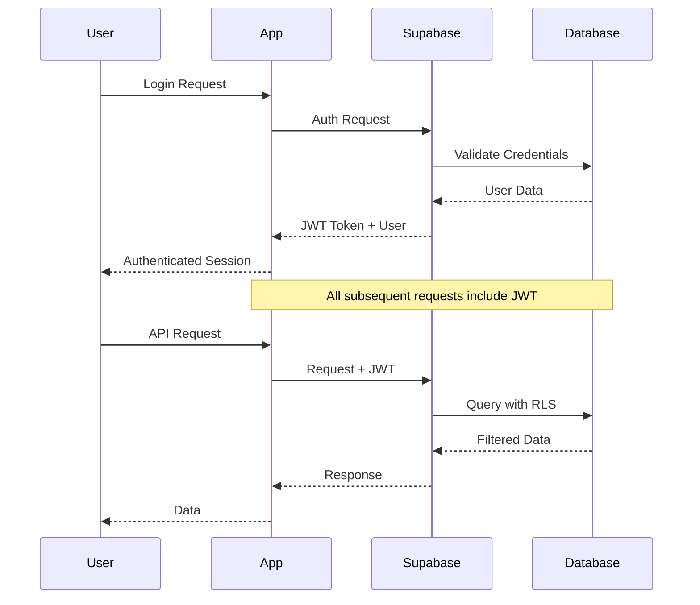

# NetNeural MVP Technical Specification & Development Blueprint
**Version**: 1.0  
**Date**: September 18, 2025  
**Status**: Master Reference Document  

---

## Executive Summary

This document serves as the **definitive technical specification** and **development rule book** for the NetNeural IoT Platform MVP. After multiple development attempts, this specification provides clear, unambiguous requirements, architecture decisions, and implementation guidelines to ensure successful delivery.

**No assumptions. No mocking. No placeholders. Production-ready from day one.**

---

## 1. System Overview

### 1.1 Platform Purpose
NetNeural is an **Enterprise-Grade IoT Platform-as-a-Service (PaaS)** that provides device management, real-time monitoring, and intelligent alert systems for mid-market enterprises.

### 1.2 Business Context
- **Target Market**: $2.3B mid-market IoT segment
- **Value Proposition**: 67% cost savings vs enterprise solutions, 3x capabilities vs developer platforms
- **Revenue Target**: $75M by year 5
- **MVP Completion Goal**: 85% production-ready components

### 1.3 Core Value Propositions
1. **Real IoT Integration**: Actual device connectivity (Golioth, MQTT, CoAP)
2. **Enterprise Security**: Multi-tenant, organization-scoped, role-based access
3. **Production Scale**: Cloud-native architecture with auto-scaling
4. **Developer Experience**: Modern stack with comprehensive tooling

---

## 2. Architecture Overview

### 2.1 High-Level Architecture

```
┌─────────────────────────────────────────────────────────────────────────────┐
│                          NetNeural IoT Platform                            │
│                        Supabase-First Architecture                         │
└─────────────────────────────────────────────────────────────────────────────┘

┌──────────────────┐    ┌─────────────────────────────────────────────────────┐
│   Frontend Tier  │    │                Supabase Platform                    │
│  (GitHub Pages)  │    │                                                     │
│                  │    │  ┌─────────────┐  ┌─────────────┐  ┌─────────────┐ │
┌──────────────────┐    ┌─────────────────────────────────────────────────────┐
│   Frontend Tier  │    │                Supabase Platform                    │
│  (GitHub Pages)  │    │                                                     │
│                  │    │  ┌─────────────┐  ┌─────────────┐  ┌─────────────┐ │
│ • Next.js 15     │◄──►│  │ Auth & RLS  │  │ PostgreSQL  │  │ Edge Functions│ │
│ • React 18.3     │    │  │ JWT Tokens  │  │ Real-time   │  │ API Routes   │ │
│ • TypeScript 5.6 │    │  │ Multi-tenant│  │ Webhooks    │  │ Serverless   │ │
│ • Static Export  │    │  │ Row Security│  │ JSON/JSONB  │  │ Deno 2.0     │ │
│ • CDN Cached     │    │  └─────────────┘  └─────────────┘  └─────────────┘ │
└──────────────────┘    │                                                     │
                        │  ┌─────────────┐  ┌─────────────┐  ┌─────────────┐ │
                        │  │ File Storage│  │ Realtime    │  │ Dashboard   │ │
                        │  │ Images/Docs │  │ WebSockets  │  │ Monitoring  │ │
                        │  │ Backups     │  │ Broadcast   │  │ Logs        │ │
                        │  │ CDN         │  │ Presence    │  │ Analytics   │ │
                        │  └─────────────┘  └─────────────┘  └─────────────┘ │
                        └─────────────────────────────────────────────────────┘
                                                    │
                                                    ▼
                        ┌─────────────────────────────────────────────────────┐
                        │                External Integrations                │
                        │                                                     │
                        │ • Golioth IoT Platform (Device Management)         │
                        │ • SMTP Services (Email Notifications)              │
                        │ • Webhook Endpoints (Real-time Events)             │
                        │ • Third-party APIs (Future Integrations)           │
                        └─────────────────────────────────────────────────────┘
```

### 2.2 Technology Stack Decision Matrix

| Component | Technology | Rationale | Alternatives Considered |
|-----------|------------|-----------|------------------------|
| **Frontend Framework** | Next.js 15 | Latest App Router, Turbopack, enhanced static export, superior TypeScript integration | Vite+React, Remix, SvelteKit |
| **UI Library** | React 18.3 | Stable concurrent features, Suspense, automatic batching, extensive ecosystem | Vue 3, Svelte, Angular |
| **Language** | TypeScript 5.6 | Latest type inference, performance improvements, reduced bundle size | JavaScript, ReScript |
| **Backend Platform** | Supabase Latest | Complete BaaS, PostgreSQL 15, real-time, auth, Edge Functions with Deno 2.0 | Firebase, AWS Amplify, Custom API |
| **Database** | PostgreSQL 15 (Supabase) | ACID compliance, JSON support, excellent performance, built-in with Supabase | MySQL, MongoDB (not compatible with Supabase) |
| **Authentication** | Supabase Auth | Built-in JWT, RLS, multi-provider, enterprise ready, social auth | Auth0, Firebase Auth, Custom |
| **API Layer** | Supabase Edge Functions | Deno 2.0 runtime, global deployment, TypeScript native, tight integration | Vercel Functions, Netlify Functions |
| **Real-time** | Supabase Realtime | WebSocket, PostgreSQL CDC, presence, broadcast, minimal setup | Socket.io, Pusher, Ably |
| **File Storage** | Supabase Storage | S3-compatible, CDN, image transforms, built-in security, RLS policies | AWS S3, Cloudinary, Uploadcare |
| **Frontend Hosting** | GitHub Pages | Free, reliable, CI/CD integration, custom domains, zero-config deployment | Vercel, Netlify, AWS S3 |
| **IoT Platform** | Golioth Latest | Enterprise features, excellent APIs, device management, webhook support | Particle, AWS IoT, Azure IoT |
| **Styling** | Tailwind CSS 3.4 | Latest container queries, modern features, excellent DX, small bundle | Styled Components, CSS Modules |
| **Build Tool** | Turbopack (Next.js 15) | Rust-based, 10x faster than Webpack, native to Next.js 15 | Vite, Webpack, esbuild |
| **Development CLI** | Supabase CLI 2.x | Latest local development, Edge Functions testing, type generation | Custom scripts, Docker Compose |
| **Monitoring** | Supabase Dashboard | Built-in logs, metrics, real-time monitoring, Edge Function insights | Sentry, DataDog, New Relic |
| **CI/CD** | GitHub Actions | Native GitHub integration, free tier, Supabase CLI support, matrix builds | GitLab CI, CircleCI, Jenkins |

---

## 3. Functional Requirements

### 3.1 Core Features (MVP)

#### 3.1.1 Authentication & Authorization
- **Multi-tenant architecture** with organization isolation
- **Role-based access control** (Admin, Manager, Viewer, Device Operator)
- **Single Sign-On (SSO)** support for enterprise customers
- **Session management** with secure token handling
- **Password policies** and two-factor authentication

#### 3.1.2 Device Management
- **Device registration** and provisioning
- **Device lifecycle management** (active, inactive, maintenance, decommissioned)
- **Device grouping** and organization
- **Bulk operations** (import, export, update, delete)
- **Device metadata** and custom properties

#### 3.1.3 IoT Platform Integration
- **Golioth integration** for device connectivity
- **Real-time device synchronization**
- **Conflict resolution** for dual-platform management
- **Webhook support** for real-time updates
- **Multi-protocol support** (MQTT, CoAP, HTTP)

#### 3.1.4 Monitoring & Alerting
- **Real-time device status** monitoring
- **Health check** automation
- **Alert rule engine** with configurable triggers
- **Notification delivery** (email, SMS, webhooks)
- **Alert escalation** and acknowledgment

#### 3.1.5 Data Management
- **Time-series data** collection and storage
- **Data retention** policies
- **Export capabilities** (CSV, JSON, API)
- **Real-time dashboards** and visualization
- **Historical data** analysis

### 3.2 Non-Functional Requirements

#### 3.2.1 Performance
- **Page load time**: < 2 seconds
- **API response time**: < 500ms (95th percentile)
- **Real-time updates**: < 1 second latency
- **Concurrent users**: Support 1000+ simultaneous users
- **Device capacity**: Handle 10,000+ devices per organization

#### 3.2.2 Reliability
- **Uptime**: 99.9% availability
- **Data durability**: 99.999999999% (11 9's)
- **Backup frequency**: Real-time with daily snapshots
- **Disaster recovery**: < 4 hour RTO, < 1 hour RPO

#### 3.2.3 Security
- **Data encryption**: AES-256 at rest, TLS 1.3 in transit
- **Authentication**: OAuth 2.0 / OpenID Connect
- **Authorization**: Row-level security (RLS)
- **Audit logging**: All actions logged and immutable
- **Compliance**: SOC 2 Type II ready

#### 3.2.4 Scalability
- **Horizontal scaling**: Auto-scaling based on load
- **Database**: Read replicas and connection pooling
- **CDN**: Global edge caching for static assets
- **Caching**: Redis for session and application data

---

## 4. Data Architecture

### 4.1 Database Schema

#### 4.1.1 Core Tables

```sql
-- Organizations (Multi-tenancy)
CREATE TABLE organizations (
    id UUID PRIMARY KEY DEFAULT gen_random_uuid(),
    name VARCHAR(255) NOT NULL,
    slug VARCHAR(100) UNIQUE NOT NULL,
    settings JSONB DEFAULT '{}',
    subscription_tier VARCHAR(50) DEFAULT 'free',
    created_at TIMESTAMPTZ DEFAULT NOW(),
    updated_at TIMESTAMPTZ DEFAULT NOW()
);

-- Users & Authentication
CREATE TABLE users (
    id UUID PRIMARY KEY DEFAULT gen_random_uuid(),
    email VARCHAR(255) UNIQUE NOT NULL,
    organization_id UUID REFERENCES organizations(id),
    role VARCHAR(50) DEFAULT 'viewer',
    is_active BOOLEAN DEFAULT true,
    created_at TIMESTAMPTZ DEFAULT NOW(),
    updated_at TIMESTAMPTZ DEFAULT NOW()
);

-- Device Services (IoT Platform Integrations)
CREATE TABLE device_services (
    id UUID PRIMARY KEY DEFAULT gen_random_uuid(),
    organization_id UUID REFERENCES organizations(id),
    name VARCHAR(255) NOT NULL,
    service_type VARCHAR(100) NOT NULL, -- 'golioth', 'aws_iot', 'azure_iot'
    config JSONB NOT NULL,
    is_active BOOLEAN DEFAULT true,
    created_at TIMESTAMPTZ DEFAULT NOW(),
    updated_at TIMESTAMPTZ DEFAULT NOW()
);

-- Devices (Core Entity)
CREATE TABLE devices (
    id UUID PRIMARY KEY DEFAULT gen_random_uuid(),
    organization_id UUID REFERENCES organizations(id),
    name VARCHAR(255) NOT NULL,
    device_id VARCHAR(255) NOT NULL, -- External device identifier
    device_type VARCHAR(100),
    status VARCHAR(50) DEFAULT 'inactive',
    metadata JSONB DEFAULT '{}',
    last_seen TIMESTAMPTZ,
    created_at TIMESTAMPTZ DEFAULT NOW(),
    updated_at TIMESTAMPTZ DEFAULT NOW(),
    UNIQUE(organization_id, device_id)
);

-- Device Service Assignments
CREATE TABLE device_service_assignments (
    id UUID PRIMARY KEY DEFAULT gen_random_uuid(),
    device_id UUID REFERENCES devices(id) ON DELETE CASCADE,
    service_id UUID REFERENCES device_services(id) ON DELETE CASCADE,
    external_device_id VARCHAR(255),
    sync_status VARCHAR(50) DEFAULT 'pending',
    last_sync TIMESTAMPTZ,
    created_at TIMESTAMPTZ DEFAULT NOW(),
    UNIQUE(device_id, service_id)
);

-- Sync Logging & Conflict Resolution
CREATE TABLE golioth_sync_log (
    id UUID PRIMARY KEY DEFAULT gen_random_uuid(),
    organization_id UUID REFERENCES organizations(id),
    operation VARCHAR(100) NOT NULL,
    device_id UUID REFERENCES devices(id),
    status VARCHAR(50) NOT NULL,
    details JSONB DEFAULT '{}',
    created_at TIMESTAMPTZ DEFAULT NOW()
);

-- Device Conflicts
CREATE TABLE device_conflicts (
    id UUID PRIMARY KEY DEFAULT gen_random_uuid(),
    device_id UUID REFERENCES devices(id),
    conflict_type VARCHAR(100) NOT NULL,
    local_value JSONB,
    remote_value JSONB,
    resolution_status VARCHAR(50) DEFAULT 'pending',
    resolved_by UUID REFERENCES users(id),
    resolved_at TIMESTAMPTZ,
    created_at TIMESTAMPTZ DEFAULT NOW()
);
```

#### 4.1.2 Row Level Security (RLS) Policies

```sql
-- Enable RLS on all tables
ALTER TABLE organizations ENABLE ROW LEVEL SECURITY;
ALTER TABLE users ENABLE ROW LEVEL SECURITY;
ALTER TABLE devices ENABLE ROW LEVEL SECURITY;
ALTER TABLE device_services ENABLE ROW LEVEL SECURITY;
ALTER TABLE device_service_assignments ENABLE ROW LEVEL SECURITY;
ALTER TABLE golioth_sync_log ENABLE ROW LEVEL SECURITY;
ALTER TABLE device_conflicts ENABLE ROW LEVEL SECURITY;

-- Organization isolation policies
CREATE POLICY "Users can only access their organization's data" ON devices
    USING (organization_id = (SELECT organization_id FROM users WHERE id = auth.uid()));

CREATE POLICY "Users can only access their organization's services" ON device_services
    USING (organization_id = (SELECT organization_id FROM users WHERE id = auth.uid()));

-- Role-based access policies
CREATE POLICY "Only admins can modify organization settings" ON organizations
    USING (id = (SELECT organization_id FROM users WHERE id = auth.uid() AND role IN ('admin', 'owner')));
```

### 4.2 API Contract Specification

#### 4.2.1 Device Management API

```typescript
// GET /api/devices
interface GetDevicesRequest {
  page?: number;
  limit?: number;
  search?: string;
  status?: 'active' | 'inactive' | 'maintenance' | 'error';
  service_id?: string;
}

interface GetDevicesResponse {
  devices: Device[];
  pagination: {
    page: number;
    limit: number;
    total: number;
    pages: number;
  };
}

// POST /api/devices
interface CreateDeviceRequest {
  name: string;
  device_id: string;
  device_type?: string;
  metadata?: Record<string, any>;
}

interface CreateDeviceResponse {
  device: Device;
  sync_results?: ServiceSyncResult[];
}

// Device Model
interface Device {
  id: string;
  organization_id: string;
  name: string;
  device_id: string;
  device_type?: string;
  status: 'active' | 'inactive' | 'maintenance' | 'error';
  metadata: Record<string, any>;
  last_seen?: string;
  created_at: string;
  updated_at: string;
  service_assignments?: DeviceServiceAssignment[];
}
```

#### 4.2.2 Golioth Integration API

```typescript
// GET /api/golioth/devices
interface GoliothDevicesResponse {
  devices: GoliothDevice[];
  sync_status: {
    last_sync: string;
    total_devices: number;
    conflicts: number;
  };
}

// POST /api/golioth/sync
interface GoliothSyncRequest {
  operation: 'import' | 'export' | 'bidirectional';
  device_ids?: string[];
  force?: boolean;
}

interface GoliothSyncResponse {
  operation_id: string;
  status: 'started' | 'completed' | 'failed';
  summary: {
    processed: number;
    successful: number;
    failed: number;
    conflicts: number;
  };
  details: SyncDetail[];
}
```

---

## 5. Development Environment Specification

### 5.1 Local Development Setup

#### 5.1.1 Required Software

```yaml
# Required Software Stack
node: "20.11.0"     # LTS version
npm: "10.2.4"       # Latest stable
supabase_cli: "1.120+"  # Primary development tool
git: "2.40+"        # Version control

# Development Tools
vscode: "1.85+"     # Primary IDE with Supabase extensions
prettier: "3.0+"    # Code formatting
eslint: "8.0+"      # Code linting
typescript: "5.3+"  # Type checking

# Supabase Development Stack
docker: "24.0+"     # For Supabase local development
postgresql: "15+"   # Database (via Supabase local)
```

#### 5.1.2 Directory Structure

```
development/
├── README.md                    # Setup and development guide
├── .env.example                 # Environment template (Supabase-focused)
├── .env.local                   # Local environment (git-ignored)
├── .gitignore                   # Git ignore rules
├── package.json                 # Dependencies with latest versions
├── package-lock.json            # Locked dependencies
├── next.config.js               # Next.js 15 configuration (static export)
├── tailwind.config.js           # Tailwind CSS 3.4 configuration
├── tsconfig.json                # TypeScript 5.6 configuration
├── .eslintrc.json               # ESLint configuration
├── .prettierrc                  # Prettier configuration
├── jest.config.js               # Jest testing configuration
├── playwright.config.ts         # E2E testing configuration
├── supabase/                    # Supabase configuration (ALL backend logic)
│   ├── config.toml              # Supabase CLI configuration
│   ├── migrations/              # Database schema migrations
│   │   ├── 20250918000001_initial_schema.sql
│   │   ├── 20250918000002_rls_policies.sql
│   │   ├── 20250918000003_device_tables.sql
│   │   └── 20250918000004_alert_system.sql
│   ├── functions/               # Edge Functions (Deno 2.0 runtime)
│   │   ├── _shared/             # Shared utilities across functions
│   │   │   ├── database.ts      # Database helpers
│   │   │   ├── auth.ts          # Auth utilities
│   │   │   └── golioth.ts       # Golioth API client
│   │   ├── device-sync/         # Golioth device synchronization
│   │   │   └── index.ts
│   │   ├── webhook-handler/     # External webhook processing
│   │   │   └── index.ts
│   │   ├── notifications/       # Alert and notification system
│   │   │   └── index.ts
│   │   ├── device-management/   # Device CRUD operations
│   │   │   └── index.ts
│   │   ├── telemetry/          # Device telemetry processing
│   │   │   └── index.ts
│   │   └── deno.json           # Deno configuration for Edge Functions
│   ├── seed.sql                 # Development seed data
│   └── storage/                 # Storage bucket configuration
├── src/                         # Next.js application source
│   ├── app/                     # Next.js 15 App Router
│   │   ├── globals.css          # Global styles
│   │   ├── layout.tsx           # Root layout (client components only)
│   │   ├── page.tsx             # Landing page (static)
│   │   ├── (auth)/              # Authentication group
│   │   │   ├── login/page.tsx
│   │   │   ├── register/page.tsx
│   │   │   └── layout.tsx
│   │   ├── (dashboard)/         # Protected dashboard group
│   │   │   ├── dashboard/page.tsx
│   │   │   ├── devices/page.tsx
│   │   │   ├── alerts/page.tsx
│   │   │   ├── settings/page.tsx
│   │   │   └── layout.tsx       # Dashboard layout with auth
│   │   └── not-found.tsx        # 404 page
│   ├── components/              # React components (client-side only)
│   │   ├── ui/                  # shadcn/ui base components
│   │   │   ├── button.tsx
│   │   │   ├── input.tsx
│   │   │   ├── card.tsx
│   │   │   └── index.ts         # Component exports
│   │   ├── auth/                # Authentication components
│   │   │   ├── LoginForm.tsx
│   │   │   ├── RegisterForm.tsx
│   │   │   └── AuthProvider.tsx
│   │   ├── dashboard/           # Dashboard-specific components
│   │   │   ├── DeviceList.tsx
│   │   │   ├── AlertCenter.tsx
│   │   │   └── RealTimeChart.tsx
│   │   ├── forms/               # Form components with react-hook-form
│   │   └── layout/              # Layout components
│   │       ├── Header.tsx
│   │       ├── Sidebar.tsx
│   │       └── Footer.tsx
│   ├── lib/                     # Core utilities and configurations
│   │   ├── supabase/            # Supabase client configurations
│   │   │   ├── client.ts        # Browser client
│   │   │   ├── server.ts        # Server client (for SSG)
│   │   │   └── middleware.ts    # Auth middleware
│   │   ├── database.types.ts    # Auto-generated from Supabase
│   │   ├── validations.ts       # Zod schemas for form validation
│   │   ├── constants.ts         # App constants
│   │   └── utils.ts             # Utility functions
│   ├── hooks/                   # Custom React hooks
│   │   ├── useAuth.ts           # Supabase auth hook
│   │   ├── useDevices.ts        # Device management hook
│   │   ├── useRealtime.ts       # Real-time subscriptions
│   │   └── useSupabase.ts       # Supabase client hook
│   ├── types/                   # TypeScript definitions
│   │   ├── auth.ts              # Auth-related types
│   │   ├── device.ts            # Device-related types
│   │   ├── api.ts               # API response types
│   │   └── index.ts             # Type exports
│   └── styles/                  # Additional styling
├── public/                      # Static assets
│   ├── icons/                   # App icons
│   ├── images/                  # Static images
│   └── manifest.json            # PWA manifest
├── docs/                        # Documentation
├── .github/                     # GitHub configuration
│   ├── workflows/               # GitHub Actions
│   │   ├── deploy.yml           # Supabase + GitHub Pages deployment
│   │   ├── test.yml             # Testing pipeline
│   │   └── security.yml         # Security scanning
│   └── ISSUE_TEMPLATE/          # Issue templates
└── tests/                       # Test files
    ├── __mocks__/               # Test mocks
    ├── components/              # Component tests
    ├── hooks/                   # Hook tests
    ├── e2e/                     # Playwright E2E tests
    └── setup.ts                 # Test setup
```

**Key Architecture Decisions:**

1. **No Frontend API Routes**: All API logic handled by Supabase Edge Functions
2. **Static Export Only**: Next.js configured for GitHub Pages deployment  
3. **Client-Side Auth**: Supabase Auth with automatic RLS enforcement
4. **Edge Functions for APIs**: All external integrations via Supabase Edge Functions
5. **Real-time by Default**: Supabase real-time for live updates
6. **Type Safety**: Auto-generated types from Supabase schema
│   ├── supabase/                # Supabase function tests
│   ├── integration/             # Integration tests
│   └── e2e/                     # End-to-end tests
├── docs/                        # Development documentation
│   ├── supabase.md              # Supabase development guide
│   ├── edge-functions.md        # Edge Functions development
│   ├── deployment.md            # Deployment guide
│   ├── testing.md               # Testing guide
│   ├── database.md              # Database schema docs
│   ├── golioth.md               # Golioth integration guide
│   ├── security.md              # Security guidelines
│   ├── performance.md           # Performance optimization
│   └── troubleshooting.md       # Common issues and solutions
└── scripts/                     # Development scripts
    ├── setup.sh                 # Initial Supabase setup
    ├── migrate.sh               # Supabase migration runner
    ├── seed.sh                  # Data seeding via Supabase
    ├── deploy-functions.sh      # Deploy Edge Functions
    └── deploy-frontend.sh       # Deploy to GitHub Pages
```

#### 5.1.3 Environment Configuration

```env
# .env.example - Template for environment variables

# === Application Configuration ===
NODE_ENV=development
NEXT_PUBLIC_APP_NAME="NetNeural IoT Platform"
NEXT_PUBLIC_APP_VERSION="1.0.0"

# === Supabase Configuration (Primary Backend) ===
NEXT_PUBLIC_SUPABASE_URL=http://127.0.0.1:54321
NEXT_PUBLIC_SUPABASE_ANON_KEY=your-local-anon-key
SUPABASE_SERVICE_ROLE_KEY=your-local-service-role-key
SUPABASE_PROJECT_REF=your-project-ref
SUPABASE_ACCESS_TOKEN=your-access-token
SUPABASE_DB_PASSWORD=your-database-password

# === Golioth Integration (via Supabase Edge Functions) ===
GOLIOTH_API_KEY=your-golioth-api-key
GOLIOTH_PROJECT_ID=your-golioth-project-id
GOLIOTH_BASE_URL=https://api.golioth.io

# === External Services (Supabase-managed) ===
# SMTP configuration is handled through Supabase Auth
# File uploads handled through Supabase Storage
# Real-time handled through Supabase Realtime

# === Security (Supabase-managed) ===
# JWT secrets handled by Supabase Auth
# RLS policies defined in migrations
# API rate limiting via Supabase Edge Functions

# === Monitoring (Supabase Dashboard) ===
# Logs available in Supabase Dashboard
# Metrics tracked via Supabase Analytics
# Error tracking via Supabase Edge Function logs
```

### 5.2 Development Scripts

#### 5.2.1 Package.json Scripts

```json
{
  "scripts": {
    "dev": "next dev",
    "dev:turbo": "next dev --turbo",
    "build": "next build",
    "build:static": "next build",
    "start": "next start",
    "lint": "next lint",
    "lint:fix": "next lint --fix",
    "type-check": "tsc --noEmit",
    "format": "prettier --write .",
    "format:check": "prettier --check .",
    "test": "jest",
    "test:watch": "jest --watch",
    "test:coverage": "jest --coverage",
    "test:e2e": "playwright test",
    
    "supabase:start": "supabase start",
    "supabase:stop": "supabase stop",
    "supabase:reset": "supabase db reset",
    "supabase:types": "supabase gen types typescript --local > src/lib/database.types.ts",
    "supabase:migrate": "supabase db push",
    "supabase:seed": "supabase db seed",
    "supabase:functions:serve": "supabase functions serve",
    "supabase:functions:deploy": "supabase functions deploy",
    "supabase:functions:new": "supabase functions new",
    
    "setup": "npm install && npm run supabase:start && npm run supabase:types",
    "setup:fresh": "npm run clean && npm install && npm run supabase:reset && npm run supabase:types",
    "clean": "rm -rf .next out node_modules/.cache",
    "check": "npm run type-check && npm run lint && npm run format:check && npm run test",
    "prepare": "npm run supabase:types || echo 'Supabase not available'",
    
    "deploy:functions": "supabase functions deploy --project-ref $SUPABASE_PROJECT_REF",
    "deploy:frontend": "npm run build && gh-pages -d out"
  }
}
```

---

## 6. CI/CD Pipeline Specification

### 6.1 GitHub Actions Workflow

#### 6.1.1 Development Pipeline

```yaml
# .github/workflows/development.yml
name: Supabase Development Pipeline

on:
  push:
    branches: [development, feature/*]
    paths: ['development/**']
  pull_request:
    branches: [development]
    paths: ['development/**']

jobs:
  test:
    runs-on: ubuntu-latest
    defaults:
      run:
        working-directory: development
    
    steps:
      - uses: actions/checkout@v4
      
      - name: Setup Node.js
        uses: actions/setup-node@v4
        with:
          node-version: '20'
          cache: 'npm'
          cache-dependency-path: development/package-lock.json
      
      - name: Install dependencies
        run: npm ci
      
      - name: Setup Supabase CLI
        uses: supabase/setup-cli@v1
        with:
          version: latest
      
      - name: Start Supabase local development
        run: supabase start
      
      - name: Run database migrations
        run: supabase db push
      
      - name: Deploy Edge Functions locally
        run: supabase functions deploy --local
      
      - name: Generate TypeScript types
        run: npm run supabase:types
      
      - name: Run type checking
        run: npm run type-check
      
      - name: Run linting
        run: npm run lint
      
      - name: Run unit tests
        run: npm run test
        env:
          NODE_ENV: test
      
      - name: Test Edge Functions
        run: npm run test:functions
      
      - name: Run build
        run: npm run build
      
      - name: Run E2E tests
        run: npm run test:e2e
        env:
          NODE_ENV: test

  security:
    runs-on: ubuntu-latest
    defaults:
      run:
        working-directory: development
    
    steps:
      - uses: actions/checkout@v4
      
      - name: Run security audit
        run: npm audit
      
      - name: Check Supabase configuration
        run: supabase db lint
      
      - name: Run dependency check
        uses: actions/dependency-review-action@v3
        if: github.event_name == 'pull_request'
```

#### 6.1.2 Production Deployment Pipeline

```yaml
# .github/workflows/production.yml
name: Supabase Production Deployment

on:
  push:
    branches: [main]
    paths: ['development/**']
  workflow_dispatch:

jobs:
  deploy:
    runs-on: ubuntu-latest
    defaults:
      run:
        working-directory: development
    
    environment: production
    
    steps:
      - uses: actions/checkout@v4
      
      - name: Setup Node.js
        uses: actions/setup-node@v4
        with:
          node-version: '20'
          cache: 'npm'
          cache-dependency-path: development/package-lock.json
      
      - name: Install dependencies
        run: npm ci
      
      - name: Setup Supabase CLI
        uses: supabase/setup-cli@v1
        with:
          version: latest
      
      - name: Link to Supabase production project
        run: supabase link --project-ref ${{ secrets.SUPABASE_PROJECT_REF }}
        env:
          SUPABASE_ACCESS_TOKEN: ${{ secrets.SUPABASE_ACCESS_TOKEN }}
      
      - name: Run database migrations
        run: supabase db push
        env:
          SUPABASE_ACCESS_TOKEN: ${{ secrets.SUPABASE_ACCESS_TOKEN }}
      
      - name: Deploy Edge Functions
        run: supabase functions deploy --project-ref ${{ secrets.SUPABASE_PROJECT_REF }}
        env:
          SUPABASE_ACCESS_TOKEN: ${{ secrets.SUPABASE_ACCESS_TOKEN }}
          GOLIOTH_API_KEY: ${{ secrets.GOLIOTH_API_KEY }}
          GOLIOTH_PROJECT_ID: ${{ secrets.GOLIOTH_PROJECT_ID }}
      
      - name: Generate production TypeScript types
        run: supabase gen types typescript --project-id ${{ secrets.SUPABASE_PROJECT_REF }} > src/lib/database.types.ts
        env:
          SUPABASE_ACCESS_TOKEN: ${{ secrets.SUPABASE_ACCESS_TOKEN }}
      
      - name: Build static frontend
        run: npm run build
        env:
          NEXT_PUBLIC_SUPABASE_URL: ${{ secrets.NEXT_PUBLIC_SUPABASE_URL }}
          NEXT_PUBLIC_SUPABASE_ANON_KEY: ${{ secrets.NEXT_PUBLIC_SUPABASE_ANON_KEY }}
          NODE_ENV: production
          GITHUB_PAGES: true
      
      - name: Deploy frontend to GitHub Pages
        uses: peaceiris/actions-gh-pages@v3
        with:
          github_token: ${{ secrets.GITHUB_TOKEN }}
          publish_dir: development/out
          cname: platform.netneural.ai
```

### 6.2 Release Management

#### 6.2.1 Version Management Strategy

```json
{
  "version": "1.0.0",
  "versionStrategy": {
    "major": "Breaking changes, architecture changes",
    "minor": "New features, enhancements",
    "patch": "Bug fixes, security updates"
  },
  "releaseChannels": {
    "alpha": "feature/* branches",
    "beta": "development branch", 
    "stable": "main branch"
  }
}
```

#### 6.2.2 Deployment Environments

| Environment | Branch | Purpose | URL | Backend | Auto Deploy |
|-------------|--------|---------|-----|---------|-------------|
| **Development** | `development` | Feature testing, integration | `dev.netneural.ai` | Supabase Project (Dev) | ✅ |
| **Staging** | `staging` | Pre-production validation | `staging.netneural.ai` | Supabase Project (Staging) | ✅ |
| **Production** | `main` | Live customer environment | `platform.netneural.ai` | Supabase Project (Prod) | Manual approval |

---

## 7. Quality Assurance Specification

### 7.1 Testing Strategy

#### 7.1.1 Testing Pyramid

```
                    🔺 E2E Tests (10%)
                   /   \
                  /     \
                 /_______\
                🔺 Integration Tests (20%)
               /             \
              /               \
             /_________________\
            🔺 Unit Tests (70%)
           /                     \
          /                       \
         /_________________________\
```

#### 7.1.2 Test Coverage Requirements

```typescript
// jest.config.js
module.exports = {
  collectCoverageFrom: [
    'src/**/*.{ts,tsx}',
    '!src/**/*.d.ts',
    '!src/**/*.stories.tsx',
  ],
  coverageThreshold: {
    global: {
      branches: 80,
      functions: 80,
      lines: 80,
      statements: 80,
    },
    'src/lib/': {
      branches: 90,
      functions: 90,
      lines: 90,
      statements: 90,
    },
    'src/app/api/': {
      branches: 85,
      functions: 85,
      lines: 85,
      statements: 85,
    },
  },
};
```

### 7.2 Code Quality Standards

#### 7.2.1 TypeScript Configuration

```json
{
  "compilerOptions": {
    "strict": true,
    "exactOptionalPropertyTypes": true,
    "noImplicitReturns": true,
    "noImplicitOverride": true,
    "noPropertyAccessFromIndexSignature": true,
    "noUncheckedIndexedAccess": true,
    "allowUnusedLabels": false,
    "allowUnreachableCode": false
  }
}
```

#### 7.2.2 ESLint Configuration

```json
{
  "extends": [
    "next/core-web-vitals",
    "@typescript-eslint/recommended",
    "@typescript-eslint/recommended-requiring-type-checking"
  ],
  "rules": {
    "@typescript-eslint/no-unused-vars": "error",
    "@typescript-eslint/no-explicit-any": "warn",
    "@typescript-eslint/prefer-nullish-coalescing": "error",
    "@typescript-eslint/prefer-optional-chain": "error",
    "prefer-const": "error",
    "no-var": "error"
  }
}
```

---

## 8. Security Specification

### 8.1 Authentication & Authorization

#### 8.1.1 Authentication Flow



#### 8.1.2 Role-Based Access Control

```typescript
// Role definitions
type UserRole = 'owner' | 'admin' | 'manager' | 'operator' | 'viewer';

// Permission matrix
const PERMISSIONS = {
  owner: ['*'],
  admin: [
    'users.*',
    'devices.*',
    'services.*',
    'organization.read',
    'organization.update'
  ],
  manager: [
    'devices.*',
    'services.read',
    'services.update',
    'users.read'
  ],
  operator: [
    'devices.read',
    'devices.update',
    'devices.create'
  ],
  viewer: [
    'devices.read',
    'services.read'
  ]
} as const;
```

### 8.2 Data Protection

#### 8.2.1 Encryption Standards

```typescript
// Data encryption configuration
const ENCRYPTION_CONFIG = {
  algorithm: 'AES-256-GCM',
  keyDerivation: 'PBKDF2',
  iterations: 100000,
  saltLength: 16,
  ivLength: 12,
  tagLength: 16
} as const;

// Database encryption
const ENCRYPTED_FIELDS = [
  'device_services.config', // IoT service credentials
  'users.personal_data',    // PII data
  'organizations.settings'  // Sensitive configuration
] as const;
```

---

## 9. Monitoring & Observability

### 9.1 Application Monitoring

#### 9.1.1 Health Check Endpoints

```typescript
// Health check configuration
interface HealthCheckResponse {
  status: 'healthy' | 'degraded' | 'unhealthy';
  timestamp: string;
  version: string;
  services: {
    database: ServiceHealth;
    golioth: ServiceHealth;
    external_apis: ServiceHealth;
  };
  metrics: {
    uptime: number;
    memory_usage: number;
    response_time: number;
  };
}

// GET /api/health
// GET /api/health/live
// GET /api/health/ready
```

### 9.2 Error Tracking

#### 9.2.1 Error Handling Strategy

```typescript
// Error classification
class NetNeuralError extends Error {
  constructor(
    message: string,
    public code: string,
    public severity: 'low' | 'medium' | 'high' | 'critical',
    public context?: Record<string, any>
  ) {
    super(message);
    this.name = 'NetNeuralError';
  }
}

// Error codes
const ERROR_CODES = {
  // Authentication (AUTH_*)
  AUTH_INVALID_TOKEN: 'AUTH_001',
  AUTH_INSUFFICIENT_PERMISSIONS: 'AUTH_002',
  
  // Device Management (DEV_*)
  DEV_NOT_FOUND: 'DEV_001',
  DEV_SYNC_FAILED: 'DEV_002',
  DEV_CONFLICT_DETECTED: 'DEV_003',
  
  // External Service (EXT_*)
  EXT_GOLIOTH_API_ERROR: 'EXT_001',
  EXT_RATE_LIMITED: 'EXT_002'
} as const;
```

---

## 10. Deployment Specification

### 10.1 Production Infrastructure

#### 10.1.1 Hosting Configuration

```yaml
# Production hosting setup - Supabase-first architecture
hosting:
  frontend:
    provider: "GitHub Pages"
    domain: "platform.netneural.ai"
    ssl: "GitHub managed"
    cdn: "Built-in GitHub CDN"
    build: "Static export from Next.js"
    
  backend:
    provider: "Supabase Cloud"
    tier: "Pro"
    region: "us-east-1"
    scaling: "auto-managed"
    
  database:
    provider: "Supabase PostgreSQL"
    version: "15.1"
    size: "small (2 vCPU, 4GB RAM)"
    storage: "8GB SSD with auto-scaling"
    backups: "daily + continuous WAL"
    
  api:
    provider: "Supabase Edge Functions"
    runtime: "Deno/TypeScript"
    regions: "Global edge deployment"
    scaling: "Serverless auto-scaling"
    
  auth:
    provider: "Supabase Auth"
    providers: "Email, OAuth (Google, GitHub)"
    jwt: "Managed by Supabase"
    rls: "PostgreSQL Row Level Security"
    
  storage:
    provider: "Supabase Storage"
    cdn: "Global CDN"
    transforms: "Image processing included"
    security: "RLS-protected buckets"
    
  realtime:
    provider: "Supabase Realtime"
    protocol: "WebSockets"
    features: "Broadcast, Presence, Postgres CDC"
    
  monitoring:
    provider: "Supabase Dashboard"
    logs: "Edge Function logs, Database logs"
    metrics: "Performance, Usage analytics"
    alerts: "Email/Slack notifications"
```

### 10.2 Environment Management

#### 10.2.1 Supabase Project Configuration

```typescript
// Environment configuration - Supabase-first
interface SupabaseEnvironmentConfig {
  app: {
    name: string;
    version: string;
    environment: 'development' | 'staging' | 'production';
  };
  supabase: {
    url: string;
    anonKey: string;
    serviceRoleKey: string;
    projectRef: string;
    region: string;
  };
  functions: {
    goliothSync: {
      apiKey: string;
      projectId: string;
      baseUrl: string;
    };
    notifications: {
      emailProvider: 'supabase' | 'resend';
      smsProvider: 'supabase' | 'twilio';
    };
  };
  storage: {
    buckets: {
      deviceImages: string;
      documents: string;
      backups: string;
    };
  };
  monitoring: {
    logLevel: 'debug' | 'info' | 'warn' | 'error';
    enableAnalytics: boolean;
    errorTracking: boolean;
  };
}
```

---

## 11. Development Standards & Guidelines

### 11.1 Coding Standards

#### 11.1.1 File Naming Conventions

```
Components:     PascalCase       (DeviceCard.tsx)
Pages:          kebab-case       (device-management.tsx)
Utilities:      camelCase        (deviceUtils.ts)
Constants:      SCREAMING_SNAKE  (API_ENDPOINTS.ts)
Types:          PascalCase       (Device.types.ts)
Hooks:          camelCase        (useDevices.ts)
```

#### 11.1.2 Component Structure

```typescript
// Component template
import React from 'react';
import { cn } from '@/lib/utils';

interface ComponentProps {
  // Props interface
}

export const Component: React.FC<ComponentProps> = ({
  // Destructured props
}) => {
  // Component logic
  
  return (
    // JSX
  );
};

Component.displayName = 'Component';

export default Component;
```

### 11.2 Git Workflow

#### 11.2.1 Branch Naming

```
main                    # Production ready code
development            # Integration branch
staging                # Pre-production testing

feature/DEV-123-add-device-sync     # New features
bugfix/DEV-456-fix-auth-bug         # Bug fixes
hotfix/DEV-789-critical-security    # Critical fixes
chore/DEV-101-update-deps           # Maintenance
```

#### 11.2.2 Commit Message Format

```
type(scope): description

[optional body]

[optional footer(s)]

Examples:
feat(devices): add Golioth sync integration
fix(auth): resolve token refresh issue
docs(api): update device endpoints documentation
test(components): add DeviceCard unit tests
```

---

## 12. Implementation Phases

### 12.1 Phase 1: Foundation (Week 1-2)

#### 12.1.1 Core Setup
- [x] Project structure creation
- [x] Development environment configuration
- [x] Supabase project setup
- [x] Basic authentication implementation
- [x] Database schema implementation
- [x] TypeScript configuration
- [x] CI/CD pipeline setup

### 12.2 Phase 2: Device Management (Week 3-4)

#### 12.2.1 Device CRUD Operations
- [ ] Device list view with pagination
- [ ] Device creation form
- [ ] Device details view
- [ ] Device editing capabilities
- [ ] Bulk operations support
- [ ] Device status management

### 12.3 Phase 3: IoT Integration (Week 5-6)

#### 12.3.1 Golioth Integration
- [ ] Golioth service configuration
- [ ] Device synchronization logic
- [ ] Conflict resolution system
- [ ] Real-time sync status
- [ ] Webhook integration
- [ ] Error handling and retry logic

### 12.4 Phase 4: Advanced Features (Week 7-8)

#### 12.4.1 Monitoring & Alerts
- [ ] Real-time dashboards
- [ ] Alert rule engine
- [ ] Notification system
- [ ] Health monitoring
- [ ] Performance metrics
- [ ] Error tracking integration

### 12.5 Phase 5: Production Readiness (Week 9-10)

#### 12.5.1 Production Preparation
- [ ] Security audit and hardening
- [ ] Performance optimization
- [ ] Load testing
- [ ] Documentation completion
- [ ] User acceptance testing
- [ ] Production deployment

---

## 13. Success Criteria & KPIs

### 13.1 Technical KPIs

```typescript
interface MVPSuccessCriteria {
  functionality: {
    device_management: 'complete';        // 100% CRUD operations
    golioth_integration: 'complete';      // Real-time sync
    authentication: 'complete';          // Multi-tenant auth
    monitoring: 'basic';                 // Health checks
  };
  
  performance: {
    page_load_time: '< 2s';              // 95th percentile
    api_response_time: '< 500ms';        // Average
    uptime: '99.9%';                     // Monthly
    device_sync_latency: '< 5s';         // Real-time updates
  };
  
  quality: {
    test_coverage: '> 80%';              // All critical paths
    type_safety: '100%';                 // No any types
    linting_errors: '0';                 // Clean codebase
    security_vulnerabilities: '0';       // No critical/high
  };
  
  business: {
    user_onboarding: '< 5 minutes';      // First device added
    platform_adoption: '> 90%';         // Feature usage
    customer_satisfaction: '> 4.5/5';   // User feedback
  };
}
```

### 13.2 Acceptance Criteria

#### 13.2.1 Must Have (MVP)
- ✅ User can register and authenticate
- ✅ User can manage devices (CRUD)
- ✅ Devices sync with Golioth platform
- ✅ Real-time device status updates
- ✅ Organization-based data isolation
- ✅ Responsive web application
- ✅ Production deployment pipeline

#### 13.2.2 Should Have (Post-MVP)
- [ ] Mobile application
- [ ] Advanced analytics dashboard
- [ ] Custom alert rules
- [ ] API rate limiting
- [ ] Audit trail reporting
- [ ] Data export capabilities

#### 13.2.3 Could Have (Future)
- [ ] Third-party integrations
- [ ] White-label customization
- [ ] Advanced user roles
- [ ] Machine learning insights
- [ ] Edge computing support

---

## 14. Risk Management

### 14.1 Technical Risks

| Risk | Probability | Impact | Mitigation |
|------|-------------|--------|------------|
| **Golioth API Changes** | Medium | High | Version pinning, API mocking, fallback strategies |
| **Supabase Limitations** | Low | High | Local development setup, migration plan |
| **Performance Bottlenecks** | Medium | Medium | Load testing, caching strategy, optimization |
| **Security Vulnerabilities** | Low | Critical | Regular audits, dependency updates, monitoring |

### 14.2 Business Risks

| Risk | Probability | Impact | Mitigation |
|------|-------------|--------|------------|
| **Market Competition** | High | Medium | Focus on unique value prop, fast iteration |
| **Customer Adoption** | Medium | High | User research, MVP validation, feedback loops |
| **Technical Debt** | Medium | Medium | Code reviews, refactoring sprints, documentation |
| **Team Scaling** | Low | Medium | Clear documentation, knowledge sharing |

---

## 15. Appendices

### 15.1 Technology Research

#### 15.1.1 Golioth Platform Analysis

```typescript
// Golioth capabilities assessment
interface GoliothAssessment {
  strengths: [
    'Enterprise-grade security',
    'Comprehensive device management',
    'Real-time data streaming',
    'Good API documentation',
    'Reasonable pricing'
  ];
  
  limitations: [
    'Limited webhook customization',
    'Rate limiting constraints',
    'Learning curve for complex scenarios'
  ];
  
  integration_complexity: 'medium';
  documentation_quality: 'good';
  api_stability: 'stable';
  support_quality: 'responsive';
}
```

### 15.2 Performance Benchmarks

#### 15.2.1 Target Performance Metrics

```typescript
interface PerformanceBenchmarks {
  page_metrics: {
    first_contentful_paint: '< 1.5s';
    largest_contentful_paint: '< 2.5s';
    cumulative_layout_shift: '< 0.1';
    first_input_delay: '< 100ms';
  };
  
  api_metrics: {
    device_list: '< 300ms';
    device_create: '< 500ms';
    device_update: '< 400ms';
    sync_status: '< 200ms';
  };
  
  database_metrics: {
    query_time_p95: '< 100ms';
    connection_pool: '50 max';
    cache_hit_ratio: '> 90%';
  };
}
```

---

## Conclusion

This technical specification provides a comprehensive blueprint for the NetNeural IoT Platform MVP. It eliminates ambiguity, provides clear implementation guidelines, and establishes measurable success criteria.

**Key Principles:**
1. **No Mocking**: All integrations must be real and functional
2. **Production Ready**: Code must be production-grade from day one
3. **Type Safety**: Full TypeScript adoption with strict settings
4. **Security First**: Multi-tenant, encrypted, auditable
5. **Performance Focused**: Optimized for scale and speed

This document serves as the **single source of truth** for all development decisions and will be updated as the platform evolves.

---

**Document Version**: 1.0  
**Last Updated**: September 18, 2025  
**Next Review**: October 18, 2025  
**Approvers**: Technical Lead, Product Owner, Architecture Team